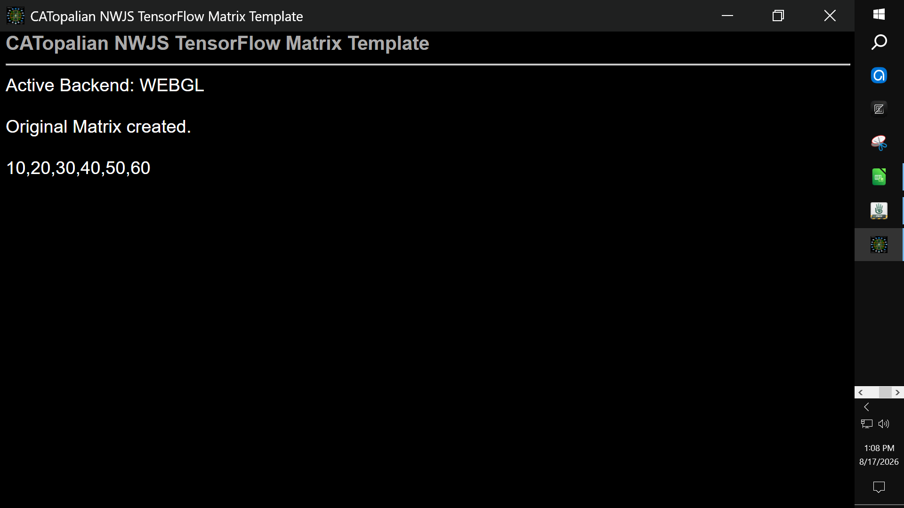

# CATopalian NWJS TensorFlow Matrix Template
This is a JavaScript NW.js Node.js HTML, CSS, TensorFlow.js application template that utilizes the GPU for reasoning!

---

REQUIREMENTS:
* Node.js https://nodejs.org/en

* NW.js https://nwjs.io/  

---

---

To run this application we:
* Download NW.js
* Extract All
* Find the nw.exe icon
* Drag the folder named v001 onto the nw.exe icon  

Full Instructions on Running our app here: https://github.com/ChristopherAndrewTopalian/CATopalian_JavaScript_NW.js

---

A standalone, zero-setup JavaScript template for calculating high-performance matrix mathematics natively on the GPU using TensorFlow.js and WebGL.

---

### How to Download this App
1. Click the green Code Button on this github page
2. Choose Download ZIP
3. Save the Zip File
4. Extract All
5. Drag the folder named v001 onto the nw.exe icon 

---

Happy Scripting :-)

---

// Dedicated to God the Father  
// All Rights Reserved Christopher Andrew Topalian Copyright 2000-2026  
// https://github.com/ChristopherAndrewTopalian  
// https://github.com/ChristopherTopalian  
// https://sites.google.com/view/CollegeOfScripting

